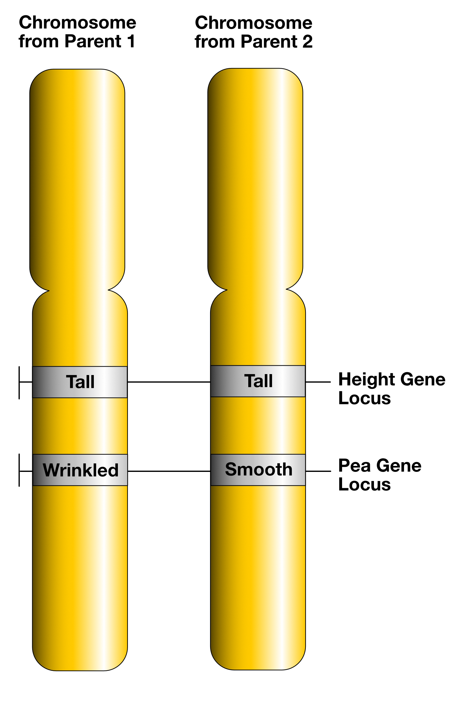

```{r setup, include = FALSE}
library(knitr)
```

<!-- adding bold and italic options -->
<style>
em {
  font-style: italic
}
strong {
  font-weight: bold;
}
</style>

## Molecular Ecology and Evolution at Bangor (MEEB)

- 3rd year module "Molecular ecology and evolution"
- https://www.bangor.ac.uk/meeb

```{r, out.width = "100%", dpi = 300, echo = FALSE, fig.align='center', fig.cap=""}
include_graphics("./assets/img/meeb_logo_NEW_no_text.jpg")
```

---

## Axel Barlow research group

- Population genomics, Paleogenomics, Conservation genomics
- Dissertation and MSc projects

```{r, out.width = "80%", dpi = 300, echo = FALSE, fig.align='center', fig.cap=""}
include_graphics("./assets/img/extinct_animals.png")
```

```{r, out.width = "80%", dpi = 300, echo = FALSE, fig.align='center', fig.cap=""}
include_graphics("./assets/img/sp4-6.png")
```

---

## Lecture schedule

1. **Drift and variation (Evolution: Chapter 6)**
2. Conservation genetics (Evolution: Chapter 6)
3. Phylogeny 1 (Evolution: Chapter 16)
4. Phylogeny 2 (Evolution: Chapter 16)

--- &twocol

## Literature

*** =left

**Course textbook**

Futuyma & Kirkpatrick. Evolution (5th Edition)

*Available as E-book from library*

**Other papers indicated in lectures**

*** =right

```{r, out.width = "80%", dpi = 300, echo = FALSE, fig.align='center', fig.cap=""}

```

--- .segue .dark 

## Key concepts

--- &twocol

## Genetic locus (plural loci)

*** =left

- Working definition: "a single position on a chromosome"
- Examples: SNP, gene, exon, mitochondrial DNA

**In diploid species**

- Individuals (mostly) have 2 copies of each locus: 1 from mum, 1 from dad
- *Except* some haploid loci (e.g. Y chr, mtDNA)

*** =right

```{r, out.width = "75%", dpi = 300, echo = FALSE, fig.align='right', fig.cap=""}

```

--- &twocol bg:white

## Alleles

*** =left

- An **Allele** is a particular genetic variant of a locus
- An individual is **heterozygous** at a locus when it has different alleles
- **Homozygous** is 2 copies of same allele
- We can also measure **allele frequencies**

**For example**

- Frequency A and B is 50% (or 0.5)
- Frequencies always sum to 100% (or 1)
- Selection on A increases its frequency

*** =right

```{r, out.width = "90%", fig.width = 4, fig.height = 5, dpi = 600, fig.align = "center", echo = FALSE, fig.cap=""}
plot(c(0,1,2,3,4), c(50, 55, 60, 70, 90),
     ylim=c(0,100), type="l", lwd=3, col="red",
     xlab="generations", ylab="allele frequency %"
)
lines(c(0,1,2,3,4), c(50, 45, 40, 30, 10), lwd=3, col="blue")
text(0.2, 60, labels="A", col="red", cex=2)
text(0.2, 40, labels="B", col="blue", cex=2)
```

--- &thirds

## Neutral evolution

*** =left

- Darwin thought about evolution in terms of natural selection
- What if there is no selection?
- Motoo Kimura: Neutral theory of molecular evolution, 1968
- Loci evolve by genetic drift
- Drift is determined by the population size
- Basis of population genetics and phylogenetics
- "Null hypothesis" of molecular evolution

*** =right

```{r, out.width = "90%", dpi = 300, echo = FALSE, fig.align='center', fig.cap=""}
include_graphics("./assets/img/Motoo_Kimura.jpg")
```

--- &twocol


## How much of the genome is selectively neutral?

**Human as an example**

*** =left

- Protein coding sequences = 2%
- Functional 10-20%
- Synonymous mutations
- Introns
- Neutral alleles
- **Selection is rare**

*** =right

```{r, out.width = "100%", dpi = 300, echo = FALSE, fig.align='centre', fig.cap=""}
include_graphics("./assets/img/494467_1_En_1_Fig1_HTML.png")
```

--- .segue .dark 

## Genetic drift

---

## Definition

- Allele frequencies will change from one generation to the next due to chance events
- includes survival, reproduction, and inheritance.

### This is Genetic drift

- The change occurs at random. 
- It does not involve one allele being favoured over another. That is selection (different process)
- Drift affects all loci in the genome
- Drift affects all populations of all species

---

```{r, out.width = "100%", dpi = 300, echo = FALSE, fig.align='center', fig.cap=""}
include_graphics("./assets/img/hedgehog-crossing-street-in-front-of-an-oncoming-car.webp")
```

---

```{r, out.width = "70%", dpi = 300, echo = FALSE, fig.align='center', fig.cap=""}
include_graphics("./assets/img/family.svg")
```

---

```{r, out.width = "90%", dpi = 300, echo = FALSE, fig.align='center', fig.cap=""}
include_graphics("./assets/img/MacquarieIslandElephantSeal.JPG")
```

---

## The process visually

```{r, out.width = "75%", dpi = 300, echo = FALSE, fig.align='center', fig.cap=""}

```

---

## Simulator

<iframe src = 'https://heavywatal.github.io/driftr.js/'></iframe>

---

## Obs 1. Drift is unbiased

<iframe src = 'https://heavywatal.github.io/driftr.js/'></iframe>

---

## Obs 2. Fluctuations are larger in small populations

<iframe src = 'https://heavywatal.github.io/driftr.js/'></iframe>

--- &twocol

## Obs 2. Fluctuations are larger in small populations

*** =left

- This is a sampling effect:
- Small samples are less likely to reflect the starting frequencies.
- Consider flipping a coin 3x vs 3,000x
- Outcomes become more consistent when averaging over a larger number of random events
- Drift is **stronger** in small populations
- Drift is **weaker** in large populations

*** =right

```{r, out.width = "80%", dpi = 300, echo = FALSE, fig.align='center', fig.cap=""}
include_graphics("./assets/img/Coin_Toss_(3635981474).jpg")
```

---

## Obs 3. Drift causes populations to become different

<iframe src = 'https://heavywatal.github.io/driftr.js/'></iframe>

--- &twocol

## Obs 3. Drift causes populations to become different

*** =left

```{r, out.width = "100%", dpi = 300, echo = FALSE, fig.align='center', fig.cap=""}
include_graphics("./assets/img/adder_female.JPG")
```

Adder, Anglesey

*** =right

```{r, out.width = "100%", dpi = 300, echo = FALSE, fig.align='center', fig.cap=""}
include_graphics("./assets/img/20240804_122314.jpg")
```

Adder, Black Forest

---

## Obs 4. Drift causes a loss of variation

<iframe src = 'https://heavywatal.github.io/driftr.js/'></iframe>

---

## Obs 4. Drift causes a loss of variation

- Genetic variation is continually lost
- Rate of loss determined by strength of drift
- Can be replaced by **mutation** or **gene flow**
- Example: isogenic lab mice: 20 generations of brother x sister mating

```{r, out.width = "50%", dpi = 300, echo = FALSE, fig.align='left', fig.cap=""}
include_graphics("./assets/img/1280px-Scid_mouse.jpg")
```

--- .segue .dark 

## Drift and selection

--- &thirds

## Drift and selection

*** =left

**(positive) Selection**

- One allele is favoured over another
- Depends on high big the fitness difference is (selection coefficient = *s*)

**Drift**

- Drift affects all loci in all populations of all species
- **Stronger** in small populations and **weaker** in large populations

**Both processes**

- Cause a reduction in diversity
- Cause populations to become different

*** =right

```{r, out.width = "100%", fig.width = 4, fig.height = 5, dpi = 600, fig.align = "center", echo = FALSE, fig.cap=""}
plot(c(0,1,2,3,4), c(50, 55, 60, 70, 90),
     ylim=c(0,100), type="l", lwd=3, col="red",
     xlab="generations", ylab="allele frequency %"
)
lines(c(0,1,2,3,4), c(50, 45, 40, 30, 10), lwd=3, col="blue")
text(0.2, 60, labels="A", col="red", cex=2)
text(0.2, 40, labels="B", col="blue", cex=2)
```

---

## Selection and drift

<iframe src = 'https://heavywatal.github.io/driftr.js/'></iframe>

--- &twocol

## Selection more effective in large populations

*** =left

```{r, out.width = "100%", dpi = 300, echo = FALSE, fig.align='left', fig.cap=""}
include_graphics("./assets/img/Drosophila_melanogaster_Proboscis.jpg")
```

- *Drosophila melanogaster*
- population size ~1 million
- s = 0.00001 = adaptive evolution

*** =right

```{r, out.width = "100%", dpi = 300, echo = FALSE, fig.align='left', fig.cap=""}
include_graphics("./assets/img/eschrichtius-robustus-01jpg.webp")
```

- Grey whale
- population size 10,000
- s = 0.00001 = effectively neutral

---

## Detecting selection

- Harder than you might think
- Drift is null hypothesis
- Always operates
- Creates similar signal:
  - change in allele frequencies
  - loss of diversity
  - population divergence
- **Look for signal above the background level of drift**

--- &twocol

## Hooded and carrion crows

*** =left

```{r, out.width = "80%", dpi = 300, echo = FALSE, fig.align = "left", fig.cap = ""}
include_graphics("./assets/img/Carrion-Crow-black-bird-portrait-of-head-and-looking-at-camera_1.jpg")
```

```{r, out.width = "80%", dpi = 300, echo = FALSE, fig.align = "left", fig.cap = ""}
include_graphics("./assets/img/Nebelkrähe_Corvus_cornix,_Belvedere,_Wien.jpg")
```

*** =right

```{r, out.width = "100%", dpi = 300, echo = FALSE, fig.align = "center", fig.cap = ""}
include_graphics("./assets/img/Distribution_of_carrion_and_hooded_crows_across_Europe.jpg")
```

---

## Hooded and carrion crows

```{r, out.width = "100%", out.height=500, dpi = 300, echo = FALSE, fig.cap = ""}
  include_graphics("./assets/img/1111crow410.full.pdf")
```

---

## Genetic drift summary

- Allele frequencies will change from one generation to the next due to chance events
- Such as survival, reproduction, and inheritance.
- Drift is unbiased, no allele is favoured
- Drift causes a loss of genetic variation (replaced by mutation or gene flow)
- Strength of drift is larger in small populations
- Drift causes populations to become different
- Selection share some features with drift, but alleles are favoured
- Selection is more effective when drift is weak
- We need to account for drift when testing for selection

--- &thankyou

## Next time:

**Conservation genetics**


