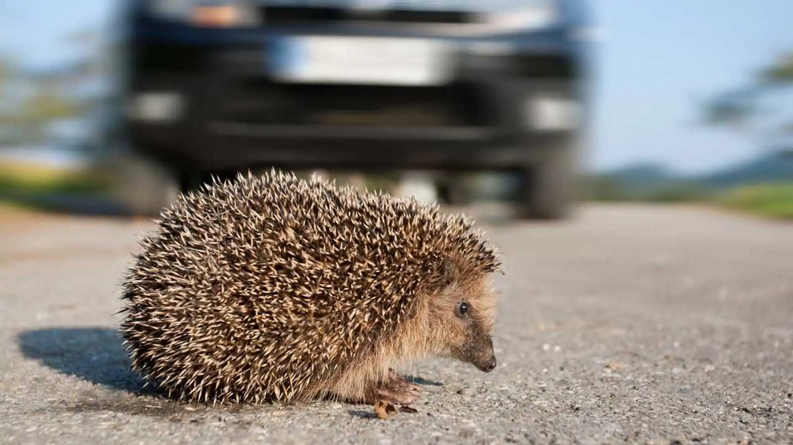
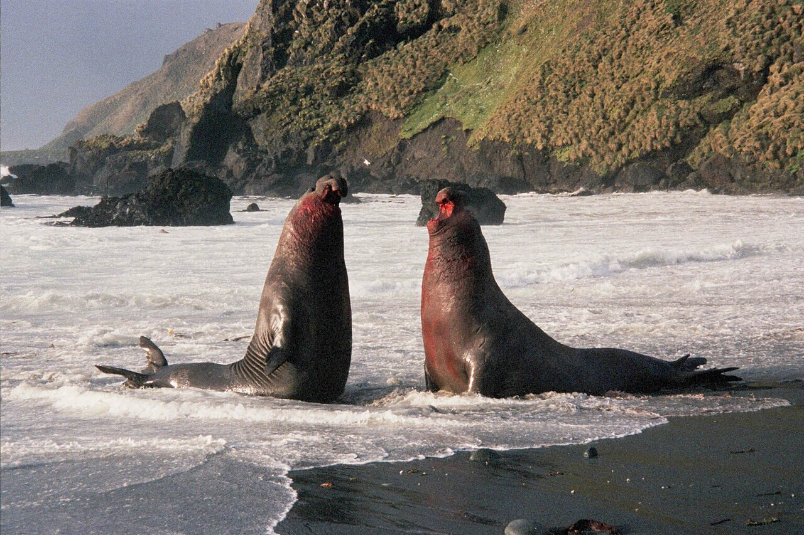
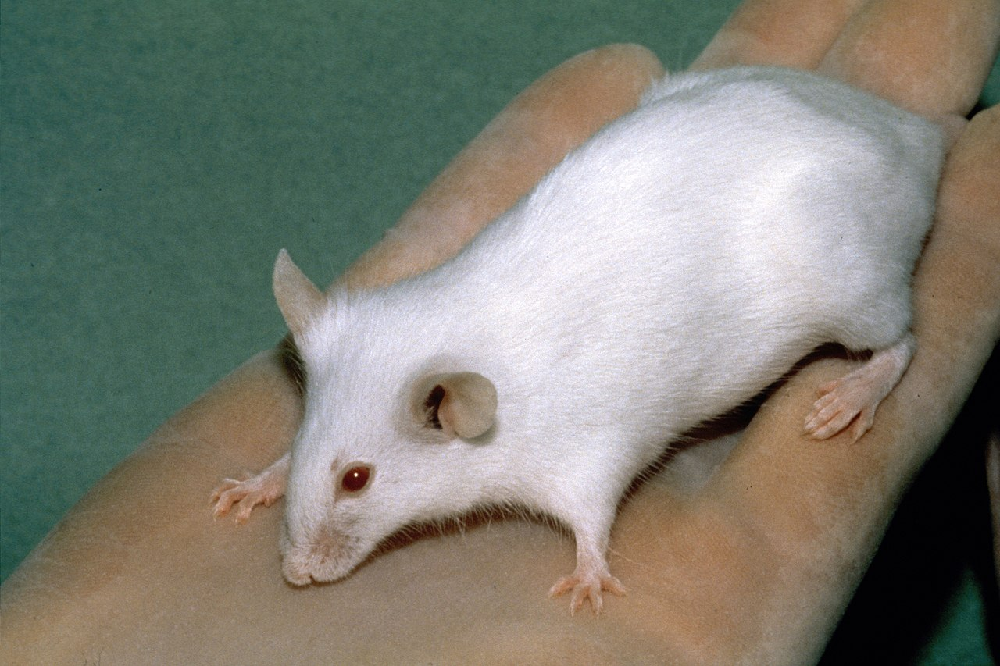

<!-- adding bold and italic options -->

## Molecular Ecology and Evolution at Bangor (MEEB)

- 3rd year module "Molecular ecology and evolution"
- https://www.bangor.ac.uk/meeb

---

## Axel Barlow research group

- Population genomics, Paleogenomics, Conservation genomics
- Dissertation and MSc projects

---

## Lecture schedule

1. **Drift and variation (Evolution: Chapter 6)**
2. Conservation genetics (Evolution: Chapter 6)
3. Phylogeny 1 (Evolution: Chapter 16)
4. Phylogeny 2 (Evolution: Chapter 16)

--- &twocol

## Literature

*** =left

**Course textbook**

Futuyma & Kirkpatrick. Evolution (5th Edition)

*Available as E-book from library*

**Other papers indicated in lectures**

*** =right

--- .segue .dark 

## Key concepts

--- &twocol

## Modern synthesis

*** =left

*** =right

---

## Population genetics

Provides the mathematical framework of how selection acts on genetic variation resulting in adaptation

*"Nothing in biology makes sense, except in the light of evolution"* (Dobzhansky 1973)

*"Nothing in evolution makes sense, except in the light of population genetics"* (Lynch 2007)

--- &twocol

## Genetic locus (plural loci)

*** =left

- Working definition: "a single position on a chromosome"
- Examples: SNP, gene, exon, mitochondrial DNA

**In diploid species**

- Individuals (mostly) have 2 copies of each locus: 1 from mum, 1 from dad
- *Except* some haploid loci (e.g. Y chr, mtDNA)

*** =right

--- &twocol bg:white

## Alleles

*** =left

- An **Allele** is a particular genetic variant of a locus
- An individual is **heterozygous** at a locus when it has different alleles
- **Homozygous** is 2 copies of same allele
- We can also measure **allele frequencies**

**For example**

- Frequency A and B is 50% (or 0.5)
- Frequencies always sum to 100% (or 1)
- Selection on A increases its frequency

*** =right

--- &thirds

## Neutral evolution

*** =left

- Darwin thought about evolution in terms of natural selection
- What if there is no selection?
- Motoo Kimura: Neutral theory of molecular evolution, 1968
- Loci evolve by genetic drift
- Drift is determined by the population size
- Basis of population genetics and phylogenetics
- "Null hypothesis" of molecular evolution

*** =right

--- &twocol

## How much of the genome is selectivel neutral?

**Human as an example**

*** =left

- Protein coding sequences = 2%
- Functional 10-20%
- Synonymous mutations
- Introns
- Neutral alleles
- **Selection is rare**

*** =right

--- .segue .dark 

## Genetic drift

---

## Definition

- Allele frequencies will change from one generation to the next due to chance events
- includes survival, reproduction, and inheritance.

### This is Genetic drift

- The change occurs at random. 
- It does not involve one allele being favoured over another. That is selection (different process)
- Drift affects all loci in the genome
- Drift affects all populations of all species

---

---

---

---

## The process visually

---

## The process with chocolate

---

## Simulator

<iframe src = 'https://heavywatal.github.io/driftr.js/'></iframe>

---

## Obs 1. Drift is unbiased

<iframe src = 'https://heavywatal.github.io/driftr.js/'></iframe>

---

## Obs 2. Fluctuations are larger in small populations

<iframe src = 'https://heavywatal.github.io/driftr.js/'></iframe>

--- &twocol

## Obs 2. Fluctuations are larger in small populations

*** =left

- This is a sampling effect:
- Small samples are less likely to reflect the starting frequencies.
- Consider flipping a coin 3x vs 3,000x
- Outcomes become more consistent when averaging over a larger number of random events
- Drift is **stronger** in small populations
- Drift is **weaker** in large populations

*** =right

---

## Obs 3. Drift causes populations to become different

<iframe src = 'https://heavywatal.github.io/driftr.js/'></iframe>

--- &twocol

## Obs 3. Drift causes populations to become different

*** =left

*Gallotia stehlini* Gran Canaria

*** =right

*Gallotia galloti* Tenerife

---

## Obs 4. Drift causes a loss of variation

<iframe src = 'https://heavywatal.github.io/driftr.js/'></iframe>

---

## Obs 4. Drift causes a loss of variation

- Genetic variation is continually lost
- Rate of loss determined by strength of drift
- Can be replaced by **mutation** or **gene flow**
- Example: isogenic lab mice: 20 generations of brother x sister mating

--- .segue .dark 

## Drift and selection

--- &thirds

## Drift and selection

*** =left

**(positive) Selection**

- One allele is favoured over another
- Depends on high big the fitness difference is (selection coefficient = *s*)

**Drift**

- Drift affects all loci in all populations of all species
- **Stronger** in small populations and **weaker** in large populations

**Both processes**

- Cause a reduction in diversity
- Cause populations to become different

*** =right

---

## Selection and drift

<iframe src = 'https://heavywatal.github.io/driftr.js/'></iframe>

--- &twocol

## Selection more effective in large populations

*** =left

- *Drosophila melanogaster*
- population size ~1 million
- s = 0.00001 = adaptive evolution

*** =right

- Grey whale
- population size 10,000
- s = 0.00001 = effectively neutral

---

## Detecting selection

- Harder than you might think
- Drift is null hypothesis
- Always operates
- Creates similar signal:
  - change in allele frequencies
  - loss of diversity
  - population divergence
- **Look for signal above the background level of drift**

--- &twocol

## Hooded and carrion crows

*** =left

*** =right

---

## Hooded and carrion crows

<embed src="./assets/img/1111crow410.full.pdf" width="100%" height="500" type="application/pdf" />

---

## Genetic drift summary

- Allele frequencies will change from one generation to the next due to chance events
- Such as survival, reproduction, and inheritance.
- Drift is unbiased, no allele is favoured
- Drift causes a loss of genetic variation (replaced by mutation or gene flow)
- Strength of drift is larger in small populations
- Drift causes populations to become different
- Selection share some features with drift, but alleles are favoured
- Selection is more effective when drift is weak
- We need to account for drift when testing for selection

--- &thankyou

## Next time:

**Conservation genetics**

